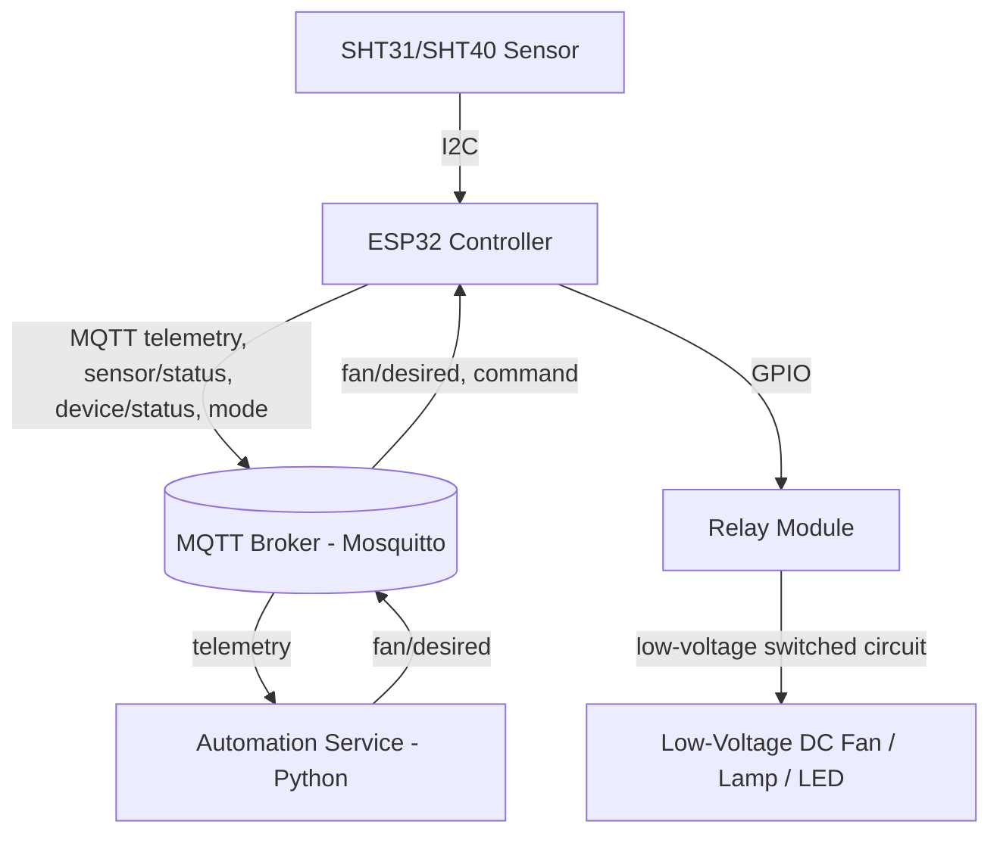

# Automated Energy-Efficient Bathroom Ventilation System

> [!IMPORTANT]
> This is a source-visible proprietary educational project. It is not
> open-source software. Copyright © 2026 Gautham. All rights reserved.
> Viewing is permitted for personal educational review, but copying,
> modification, redistribution, deployment, and derivative works require
> prior written permission. See [LICENSE](LICENSE).

An ESP32 + MQTT prototype that measures bathroom humidity, decides when
ventilation is needed, and switches a relay-controlled load accordingly -
with hysteresis and timing controls to minimize unnecessary runtime, and
a local fallback controller so ventilation keeps working even if Wi-Fi or
the MQTT broker are unavailable.

> **Safety notice**: this is a low-voltage DC bench prototype. Never wire
> household mains voltage to any part of this build. See
> [docs/safety.md](docs/safety.md) before connecting anything.

## Overview

A humidity/temperature sensor feeds an ESP32, which publishes telemetry
over MQTT. An external Python automation service evaluates configurable
threshold + hysteresis rules against that telemetry and publishes the
desired fan state back over MQTT. The ESP32 applies that command through
a relay - subject to its own minimum on/off timers and a maximum-runtime
safety cutoff - and, if MQTT becomes stale or unavailable, falls back to
running the identical hysteresis logic locally using its own sensor
readings. A low-voltage DC fan, lamp, or LED stands in for a real exhaust
fan during development.

## Goals

- Reduce unnecessary fan runtime (and the energy/noise cost that goes
  with it) versus continuous or fixed-timer ventilation, without
  sacrificing responsiveness to an actual humidity event.
- Keep ventilation working even when the network, broker, or automation
  service is unavailable.
- Be fully testable and demonstrable without any physical hardware.
- Make every safety-relevant decision (default states, fail-safe
  behavior, anti-cycling, max runtime) explicit and documented, not
  implicit in the code.

## Features

- ESP32 firmware (PlatformIO) with a hardware-independent control core,
  unit-testable with no ESP32 attached.
- SHT31/SHT40 humidity+temperature sensing (documented DHT22 extension
  point).
- MQTT telemetry, state, and command topics with JSON payloads, QoS,
  retention, and staleness rules documented in
  [docs/mqtt-api.md](docs/mqtt-api.md).
- Configurable hysteresis, minimum on/off timers, and a maximum
  continuous-runtime safety cutoff.
- Local fallback control on the ESP32 when MQTT is stale/unavailable.
- Manual override (on / off / automatic) via MQTT, with automatic,
  configurable-duration timeout back to automatic mode.
- Optional (disabled by default) humidity rise-rate detection.
- A complete software-only simulator - humidity profile generation, a
  simulated device, and a real end-to-end demonstration against a real
  Mosquitto broker and the real automation service.
- An energy-efficiency comparison (continuous vs. fixed-time vs.
  humidity-controlled ventilation).
- Authenticated Mosquitto broker configuration with an ACL template and
  TLS guidance.

## Architecture



See [docs/architecture.md](docs/architecture.md) for the full control
flow, module boundaries, and design rationale.

### Control flow (summary)

1. ESP32 samples the sensor every `sensor_sample_interval_seconds` and
   publishes telemetry every `telemetry_publish_interval_seconds`.
2. The automation service validates telemetry, evaluates hysteresis +
   timers, and publishes a `fan/desired` command.
3. The ESP32 applies that command in `automatic` mode while it's fresh -
   always still subject to its own min-on/min-off timers and max-runtime
   cutoff.
4. If `fan/desired` goes stale (default 60s) or MQTT drops, the ESP32
   switches to `local_fallback` and runs the same hysteresis logic using
   its own last valid sensor reading.
5. A manual override (via the `command` topic) takes precedence for its
   configured duration, then reverts to automatic - the max-runtime
   cutoff still applies even during an override.

## Hardware requirements

| Part | Notes |
|---|---|
| ESP32 dev board | e.g. ESP32-DevKitC / WROOM-32 |
| SHT31-D or SHT40 (I2C) | Primary sensor; DHT22 documented as a lower-cost alternative |
| 3.3V-logic-compatible 1-channel relay module | Opto-isolated input stage recommended |
| 5-12V DC fan, lamp, or LED+resistor | **Low-voltage load only** - see the safety notice above |
| Separate DC bench supply for the load | Keeps the load isolated from the ESP32's own supply |
| 10kΩ resistor | Belt-and-suspenders pull to hold the relay off during boot (see below) |

Full BOM, pin assignments, wiring diagram, and active-high/low details:
[docs/hardware.md](docs/hardware.md).

## Wiring summary

- I2C: ESP32 GPIO21 (SDA) / GPIO22 (SCL) -> SHT31/40.
- Relay control: ESP32 GPIO27 -> relay signal input (GPIO27 is not an
  ESP32 boot-strapping pin - see [docs/hardware.md](docs/hardware.md)).
- Relay logic power: ESP32 3V3/GND -> relay module logic side.
- Load: separate DC supply -> relay COM/NO -> fan/lamp/LED -> supply
  return. The load circuit shares no conductor with the ESP32 other than
  through the relay's switch contacts.

## Software prerequisites

- [PlatformIO](https://platformio.org/) (CLI or IDE) for firmware.
- Python 3.9+ for the automation service, simulator, and energy report.
- [Docker](https://www.docker.com/) + Docker Compose for Mosquitto (and
  optionally the automation service) locally.

## Quick-start: simulation (no hardware required)

```bash
python -m pip install -r automation/requirements.txt
python -m pip install -r simulator/requirements.txt
python simulator/simulator/run_e2e_demo.py
```

This brings up an ephemeral local Mosquitto broker, the real automation
service, and a simulated ESP32, scripts a humidity sequence through every
control-logic scenario in [docs/testing.md](docs/testing.md), and exits
non-zero if any expected transition doesn't happen.

To run every feasible automated check (firmware unit tests, automation
tests, simulator tests, the end-to-end demo, and the energy report) in
one command:

```bash
python scripts/run_full_check.py
```

## Broker setup (local development)

```bash
cp .env.example .env
# edit .env with your own local credentials, then:
./scripts/generate_mosquitto_passwd.sh      # or generate_mosquitto_passwd.ps1 on Windows
docker compose up -d mosquitto
```

See [docs/security.md](docs/security.md) for authentication, ACLs, and
TLS guidance - **do not** expose this broker to the public internet.

## Automation service setup

```bash
cd automation
python -m pip install -r requirements.txt
python -m pytest tests/ -q
python -m automation_service.main   # reads config/defaults.yaml + .env
```

Or run it as a container alongside Mosquitto:

```bash
docker compose up -d
```

## Firmware configuration

1. `cp firmware/include/secrets.example.h firmware/include/secrets.h`
   and fill in your Wi-Fi SSID/password and MQTT host/credentials.
   `secrets.h` is git-ignored - never commit it.
2. Adjust thresholds/timers in `firmware/include/config.h` if you need
   different defaults than `config/defaults.yaml` (keep the two in sync -
   see `automation/tests/test_config_parity.py`).
3. Confirm `RELAY_ACTIVE_LOW` matches your specific relay module (see
   [docs/hardware.md](docs/hardware.md)).

## Firmware build and flashing

```bash
cd firmware
pio run -e esp32dev            # compile
pio run -e esp32dev -t upload  # flash (requires a connected ESP32)
pio device monitor              # serial log
```

Flashing and the serial monitor require a physically connected ESP32 and
were **not** exercised during this build - see
[docs/requirements-traceability.md](docs/requirements-traceability.md).

## MQTT topic summary

| Topic | Publisher | Purpose |
|---|---|---|
| `bathroom/ventilation/telemetry` | device | Full periodic telemetry |
| `bathroom/ventilation/sensor/humidity`, `.../temperature` | device | Latest-value convenience topics |
| `bathroom/ventilation/command` | automation/operator | Manual override |
| `bathroom/ventilation/fan/desired` | automation (or device, in fallback) | Desired relay state |
| `bathroom/ventilation/fan/actual` | device | Actual relay state |
| `bathroom/ventilation/mode` | device | Operating mode / fallback / override status |
| `bathroom/ventilation/device/status` | device (LWT) | Online/offline |
| `bathroom/ventilation/sensor/status` | device | Sensor validity |
| `bathroom/ventilation/config` | device | Effective configuration snapshot |

Full schemas, QoS, retention, and rationale:
[docs/mqtt-api.md](docs/mqtt-api.md).

## Configuration reference

Canonical defaults live in [config/defaults.yaml](config/defaults.yaml)
(mirrored in `firmware/include/config.h` for the firmware build - see
[docs/architecture.md](docs/architecture.md) "Configuration as a single
source of truth"):

| Setting | Default |
|---|---|
| Fan-on threshold | 70% RH |
| Fan-off threshold | 60% RH |
| Sensor sampling interval | 5 s |
| Telemetry publish interval | 10 s |
| Minimum fan-on duration | 120 s |
| Minimum fan-off duration | 30 s |
| Maximum continuous runtime | 1800 s (30 min) |
| Stale telemetry/command timeout | 60 s |
| Relay startup state | OFF |
| Rise-rate detection | disabled |

## Local fallback

If `fan/desired` goes stale (no fresh command within
`stale_command_timeout_seconds`) or MQTT is unreachable, the ESP32 stops
waiting for automation and runs the same hysteresis/timer logic locally
against its own sensor readings, publishing `mode` with
`fallback_active: true` the moment it switches. See
[docs/safety.md](docs/safety.md) for the full precedence rules (manual
override > max-runtime cutoff > automatic > local fallback).

## Testing

```bash
# Firmware (no hardware required)
cd firmware && pio test -e native

# Automation service
cd automation && python -m pytest tests/ -q

# Simulator
cd simulator && python -m pytest tests/ -q

# Everything, including the end-to-end demo and energy report
python scripts/run_full_check.py
```

See [docs/testing.md](docs/testing.md) for exactly what each layer
covers and what was and wasn't run (hardware requirements are called out
explicitly).

## Expected demonstration output

Running `python simulator/simulator/run_e2e_demo.py` prints one line per
checklist step and ends with:

```
[e2e] ALL END-TO-END CHECKS PASSED
[e2e] shutting down cleanly
```

## Energy-efficiency evaluation

```bash
python energy/energy_report.py
```

Compares continuous, fixed-time, and humidity-controlled ventilation
over a configurable duration and fan wattage, using the same control
algorithm implemented elsewhere in this repository. This is a
**simulated estimate against a synthetic humidity profile, not a
measurement of a real fan or room** - see
[docs/testing.md](docs/testing.md) and the report's own "Limitations"
section for what it does and doesn't claim.

## Physical commissioning status

**Not physically commissioned.** No physical ESP32, sensor, relay, or
load was connected during this build - everything above was verified in
software/simulation only. See
[docs/physical-commissioning.md](docs/physical-commissioning.md) for the
checklist to work through before relying on real hardware, and
[docs/requirements-traceability.md](docs/requirements-traceability.md)
for the itemized verification status of every requirement.

## Safety warning

**Low-voltage DC bench prototype only.** Do not connect mains voltage to
any part of this build. A real bathroom installation requires moisture/
condensation protection, proper earthing, overcurrent protection,
appropriately rated enclosures and relays, and compliance with local
electrical code - typically installation by a qualified electrician.
Passing this project's software tests does not certify any assembly for
mains-voltage or bathroom use. Full details: [docs/safety.md](docs/safety.md).

## Security guidance

Do not expose the MQTT broker to the public internet without authentication
and TLS. Use separate credentials for the device and the automation
service, keep all real credentials out of git (`.env`, `config/device.json`,
`firmware/include/secrets.h` are all git-ignored), and see
[docs/security.md](docs/security.md) for the full model, including topic
ACLs and TLS setup.

## Troubleshooting

See [docs/hardware.md](docs/hardware.md) "Troubleshooting" for
relay/GPIO issues, and [docs/mqtt-api.md](docs/mqtt-api.md) /
[docs/security.md](docs/security.md) for connectivity/auth issues. A
quick checklist:

- Broker refuses connections: confirm `.env` credentials match
  `mosquitto/config/mosquitto.passwd` (regenerate with
  `scripts/generate_mosquitto_passwd.sh`/`.ps1`).
- Device never leaves `local_fallback`: check the automation service is
  running and subscribed (`docker compose logs automation`), and that
  `fan/desired` is being published (retained) on the broker.
- Relay behaves inverted: check `RELAY_ACTIVE_LOW` / `relay.active_low`
  against your specific module.

## Known limitations

- No physical hardware has been tested (see "Physical commissioning
  status" above).
- The energy report is a control-policy simulation, not a real
  measurement.
- Node-RED is documented as a viable automation-service alternative but
  not implemented - only the Python service is provided.
- No per-device X.509 client certificates (username/password auth only).

## Future improvements

- Physical commissioning against real hardware (see
  [docs/physical-commissioning.md](docs/physical-commissioning.md)).
- Optional Node-RED flow as an alternative to the Python automation
  service.
- Occupancy sensing or scheduling as additional automation inputs.
- Per-device TLS client certificates.

## Contributions

This is a personal educational project maintained solely by Gautham.
Unsolicited contributions, pull requests, and feature submissions are not
accepted.

If you identify a security concern, avoid publishing sensitive exploit
details publicly. Use an owner-provided private contact method if one is
available. No contact address is published by default.

## Author

**Gautham** - sole author, maintainer, owner, and copyright holder. See
[CONTRIBUTING.md](CONTRIBUTING.md).

## License

License: Proprietary — All Rights Reserved. See [LICENSE](LICENSE) for the
full terms. This is a **source-visible** project, not open-source software:
public visibility permits personal educational review only and does not
grant any right to copy, modify, redistribute, deploy, or reuse this work.
