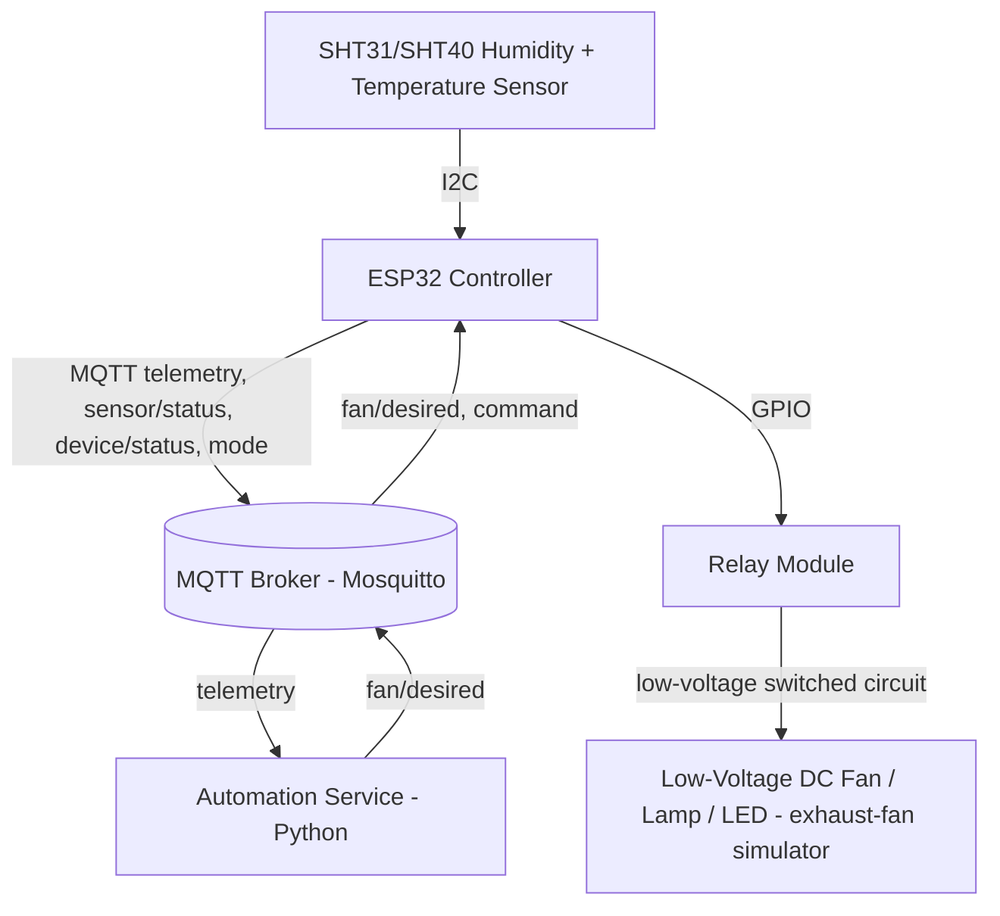

# Architecture

## Logical architecture

Sensing and relay control run on the **same ESP32** (a single physical
device sits in the bathroom), which keeps wiring simple for a prototype.
The automation decision (threshold + hysteresis evaluation of telemetry)
runs as an **external Python service** so the control policy can be
changed, extended, or observed without reflashing firmware - while the
ESP32 always retains a **local fallback** copy of the same policy so
ventilation keeps working if the network, broker, or automation service is
unavailable (see "Local fallback" below and `docs/safety.md`).

## Software module boundaries

Both the firmware and the automation service are split along the same
seams, so the two implementations of the control policy stay easy to keep
in sync and easy to reason about independently:

| Concern | Firmware module | Automation-service module |
|---|---|---|
| Sensor acquisition | `firmware/src/sensor.*` (`SensorReader` interface + `Sht3xSensor`, with a `MockSensor` for tests and a documented `Dht22Sensor` extension point) | n/a (consumes telemetry over MQTT) |
| Local safety control | `firmware/src/controller.*` (`VentilationController`, pure logic, hardware-independent) | n/a (mirrored logic in `automation/automation_service/rules.py`, used when acting as the authoritative source) |
| MQTT communication | `firmware/src/mqtt_client.*` | `automation/automation_service/mqtt_handler.py` |
| Automation decisions | `firmware/src/controller.*` (fallback path only) | `automation/automation_service/rules.py` (`HysteresisRule`) |
| Relay actuation | `firmware/src/relay.*` (`RelayDriver`, active-high/active-low abstraction) | n/a |
| Configuration | `firmware/include/config.h` (compiled-in defaults) + `config/device.json` (per-device secrets/overrides, not committed) | `automation/automation_service/config.py` (reads `config/defaults.yaml` + `.env`) |
| Diagnostics | `firmware/src/diagnostics.*` (structured serial logging, health payload) | Python `logging` module, structured log lines |

`VentilationController` in firmware is written as **plain,
Arduino/ESP32-independent C++** (no `Wire.h`, no `WiFi.h`, no MQTT calls
inside it) specifically so it can be unit-tested on the PlatformIO
`native` platform (i.e. compiled and run as a normal desktop binary) with
no hardware attached. `main.cpp` is the only place that wires the pure
controller to the real sensor/relay/MQTT hardware drivers.

## Control flow

1. `SensorReader` samples humidity/temperature every
   `sensor_sample_interval_seconds` (default 5 s), validating range and
   counting consecutive failures.
2. Every `telemetry_publish_interval_seconds` (default 10 s) the ESP32
   publishes a `telemetry` message and the individual `sensor/status` /
   `mode` / `fan/actual` messages when they change.
3. The automation service subscribes to `telemetry`, validates the
   payload, tracks freshness per `device_id`, and evaluates
   `HysteresisRule` (identical thresholds/timers to the firmware) to
   publish a `fan/desired` command.
4. The ESP32 subscribes to `fan/desired`. While a fresh (non-stale) command
   exists, `operating_mode = "automatic"` and the device applies the
   automation service's desired state (subject to its own min-on/min-off
   and max-runtime safety timers, which are never bypassed by an external
   command).
5. If `fan/desired` becomes stale (`stale_command_timeout_seconds`, default
   60 s) or the MQTT connection drops, the ESP32 switches to
   `operating_mode = "local_fallback"` and evaluates its own
   `VentilationController` using the last valid local sensor reading.
6. A manual override, received via the `command` topic, takes precedence
   over both automatic and fallback control for its configured duration
   (still bounded by the max-runtime safety cutoff), then automatically
   reverts to `"automatic"`.

## Configuration as a single source of truth

`config/defaults.yaml` is the documented canonical set of tunables. The
Python side (automation service, simulator, energy report) loads it
directly. The firmware side cannot parse YAML at boot without adding a
heavyweight dependency, so `firmware/include/config.h` mirrors the same
values as named C++ constants, with a comment pointing back to
`config/defaults.yaml`. Both are covered by tests that assert the two
files' default values match (`automation/tests/test_config_parity.py`),
so the two implementations cannot silently drift.

## Why an external automation service instead of only on-device logic

Requirement 5 (local fallback) already guarantees the ESP32 can run the
full hysteresis policy by itself. The external automation service exists
to satisfy the requirement for MQTT-driven, centrally configurable
automation rules that can be changed, logged, and extended (e.g. adding
occupancy input, schedules, or a dashboard) without reflashing every
device - a common and well-supported IoT pattern. Python was chosen over
Node-RED for this prototype because it gives strongly-typed, unit-testable
rule logic and a straightforward `pytest` test suite that mirrors the
firmware's own native unit tests; the flow-based Node-RED alternative is
documented as a viable substitute in `README.md` but not implemented here,
to avoid maintaining two automation implementations.
