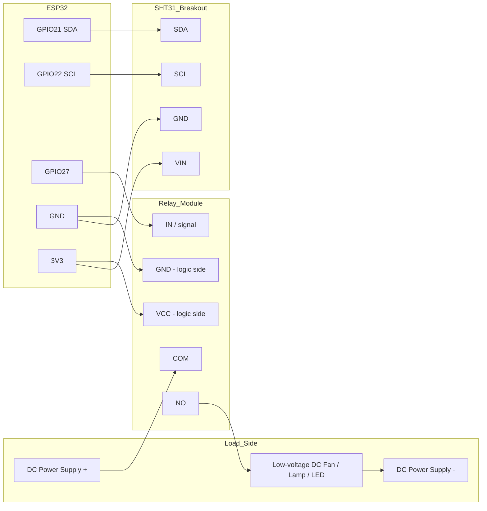

# Hardware

> **This document describes a low-voltage bench prototype only.** See the
> safety warning in `docs/safety.md` before connecting anything. Nothing
> here is sufficient to certify a mains-voltage bathroom installation.

## Bill of materials

| # | Part | Purpose | Compatible alternatives |
|---|---|---|---|
| 1 | ESP32 DevKit (e.g. ESP32-DevKitC, ESP32-WROOM-32 dev board) | Main controller, Wi-Fi | Any ESP32 dev board with exposed I2C and GPIO pins; ESP8266 could run the automation-lite fallback but lacks the RAM/peripherals used here, so it is not recommended |
| 2 | SHT31-D or SHT40 breakout board (I2C) | Humidity + temperature sensing | DHT22 (documented below, not recommended as primary) |
| 3 | 1-channel 3.3 V-logic-compatible relay module (opto-isolated input stage, e.g. a "low-level trigger" SRD-05VDC-SL-C carrier board) | Switches the low-voltage load | Solid-state relay (SSR) module rated for the load; a discrete MOSFET/transistor driver stage (see below) if no ready-made module is available |
| 4 | 5 V or 12 V DC fan (small brushless DC fan, e.g. a 12V 0.1-0.2A computer-style fan) | Exhaust-fan **simulator** load | 5-12 V DC lamp; LED + series resistor; any current-limited bench load |
| 5 | External 5 V or 12 V DC bench power supply for the fan/lamp load | Powers the load side of the relay, isolated from the ESP32's own 5 V/3.3 V rails | Any regulated DC supply matching the load's rating |
| 6 | 10 kΩ resistor | External pull to hold the relay's control line at its inactive level while the ESP32 GPIO is floating during boot/reset/flashing (belt-and-suspenders alongside firmware-level `pinMode`/`digitalWrite` ordering) | N/A |
| 7 | Breadboard, jumper wires, USB cable | Prototyping | N/A |
| 8 | Common ground jumper between the ESP32 supply ground and the relay module's logic-side ground (only if the specific relay module is *not* truly opto-isolated on its control side, or if it is and both sides intentionally share ground for this prototype - see "Isolation" below) | Reliable logic-level switching | N/A |

DHT22 alternative: cheaper and widely available, but has a slower response
time (~2 s minimum between reads vs. SHT31/40's sub-second response),
coarser humidity accuracy (typically ±2-5% RH vs. SHT31's ±2% RH / SHT40's
±1.8% RH), and known sensitivity to condensation - a real risk in a
bathroom. It is supported through the same `SensorReader` interface (see
`docs/architecture.md`) but is **not** the default and is not the sensor
this prototype was built and tested against.

## Pin assignment

| Signal | ESP32 GPIO | Notes |
|---|---|---|
| I2C SDA (to SHT31/40) | GPIO21 | ESP32 default I2C SDA; not a boot-strapping pin |
| I2C SCL (to SHT31/40) | GPIO22 | ESP32 default I2C SCL; not a boot-strapping pin |
| Relay control output | GPIO27 | General-purpose output pin; **deliberately not** GPIO0, GPIO2, GPIO5, GPIO12, or GPIO15 (ESP32 boot-strapping pins whose state at reset affects boot mode / flash voltage and which can glitch briefly during reset before firmware runs) |
| Status/fallback indicator LED (optional) | GPIO4 | Not required for core function; lights while `operating_mode == "local_fallback"` |

GPIO34-39 were avoided entirely for outputs since they are input-only on
the ESP32; they were not needed here anyway.

## Wiring

- The **load side** (power supply -> relay COM/NO contacts -> fan/lamp) is
  a completely separate low-voltage DC circuit from the ESP32's own supply.
  It shares no conductor with the ESP32 other than through the relay's
  switch contacts.
- The **control side** (ESP32 GPIO27 -> relay module signal input, ESP32
  3V3 -> relay module logic VCC, ESP32 GND -> relay module logic GND) does
  share ground with the ESP32, which is normal and required for a GPIO to
  reliably drive the relay module's input transistor/optocoupler - see
  "Isolation" below for why this does not defeat opto-isolation on
  cheap modules.

## Active-high vs. active-low, and why the default is active-low

Most common low-cost 1-channel relay modules sold for hobby use (the
"HiLetgo/SainSmart-style" SRD-05VDC-SL-C carrier boards) are **active-low**:
driving the `IN` pin to logic LOW turns the relay **on** (energized), and
logic HIGH keeps it **off** (de-energized). This is a consequence of the
onboard NPN transistor/optocoupler stage, not something the ESP32 controls
directly.

**This must be verified against your specific module's datasheet or
silkscreen before wiring** - some modules are active-high. The firmware
exposes this as a single configuration flag
(`relay.active_low` in `config/defaults.yaml`, `RELAY_ACTIVE_LOW` in
`firmware/include/config.h`) so it can be flipped without touching control
logic. The prototype in this repository was designed and its firmware
defaults set for an **active-low** module; if your module is active-high,
set `RELAY_ACTIVE_LOW` to `false` before flashing.

- **Normally Open (NO) / Normally Closed (NC) contacts**: this design uses
  the **NO** contact so that, with the relay de-energized (the documented
  safe default), the load circuit is **open** and the fan/lamp is off.
  Wiring the load to the NC contact would invert this - the load would be
  *on* whenever the relay is de-energized, including during boot and any
  firmware fault - which is the opposite of the required fail-safe
  default and must not be done in this design.

## Startup / reset / flashing safety

The relay must never energize, even briefly, during ESP32 power-up, reset,
or firmware flashing. Two complementary measures are used:

1. **Firmware ordering**: `setup()` calls `pinMode(RELAY_PIN, OUTPUT)`
   immediately followed by `digitalWrite(RELAY_PIN, RELAY_INACTIVE_LEVEL)`
   as the very first statements, before Wi-Fi, MQTT, or sensor
   initialization, minimizing the window where the pin's output state is
   undetermined. See `firmware/src/relay.cpp`.
2. **Hardware pull resistor**: GPIO27 floats (high-impedance input) from
   power-on until the firmware's first `pinMode` call executes - typically
   tens of milliseconds, but this window exists on every reset and during
   flashing while the bootloader runs. A 10 kΩ resistor from GPIO27 to
   3V3 (for an active-low relay module, so the floating/undriven state
   reads as the inactive HIGH level) holds the relay module's input at its
   inactive level throughout that window. **If your relay module already
   has a built-in pull-up on its signal input (common on
   opto-isolated active-low modules, since it is exactly this
   the manufacturer designed it to prevent) this external resistor is
   redundant but harmless; verify against your module's schematic if in
   doubt.**

GPIO27 was chosen specifically because it is not one of the ESP32's boot-
strapping pins (GPIO0, 2, 5, 12, 15), which can be pulled to specific
levels by the boot ROM/bootloader during reset and flashing regardless of
any pull resistor you add - using one of those pins for the relay would
risk exactly the transient-energization failure mode this section exists
to prevent.

## Relay module supply, contact ratings, and safe load limits

- Confirm your specific relay module's **input voltage** (most common
  modules use a 5 V logic/relay-coil supply, but the *signal* input is
  usually 3.3 V-tolerant on opto-isolated modules - verify this explicitly;
  a module without an optocoupler/transistor input stage that expects a
  true 5 V logic HIGH may not reliably switch from a 3.3 V ESP32 GPIO and
  needs a transistor or logic-level-shifter stage inserted).
- Confirm the module's **coil/trigger current** draw is within what your
  3V3 rail (if powering the module's logic side from the ESP32) or a
  separate 5 V supply can provide.
- Respect the module's **contact ratings** (typically printed on the
  relay itself, e.g. "10 A 250 VAC / 10 A 30 VDC") - this prototype's
  low-voltage DC load (well under 1 A) is far inside those limits, which
  is intentional: the contacts are never the limiting factor in this
  build.
- **Flyback protection**: if you substitute a DC motor/fan load (inductive)
  instead of a resistive lamp/LED load and your relay module does not
  already include a flyback diode across its contacts or at the load, add
  a flyback diode (e.g. 1N4007) across the fan's terminals, cathode to the
  positive supply rail, to protect the relay contacts from inductive
  kickback when switching off. Most small 5-12 V DC fans draw little
  enough current that this is a best-practice precaution rather than a
  strict requirement, but it costs one diode and is cheap insurance.

## Isolation

An opto-isolated relay module only provides real electrical isolation
between its control side and load side if the board's **ground planes for
the two sides are not tied together** and the load side is powered from a
supply that is not itself referenced to the ESP32's ground. Many cheap
carrier boards silkscreen "optically isolated" but ship with a jumper or
PCB trace that ties both grounds together for convenience - if present,
that jumper/trace defeats the isolation and must be physically removed if
true isolation is required for your use case.

For this **low-voltage DC prototype**, true galvanic isolation between
control and load sides is a nice-to-have, not a safety requirement, since
both sides are low-voltage DC and a common ground fault would not be
dangerous. It becomes a hard requirement the moment any mains-voltage
wiring is involved - see `docs/safety.md`.

## Power budget

| Rail | Consumer | Typical draw |
|---|---|---|
| USB 5 V (ESP32 supply) | ESP32 DevKit board (Wi-Fi active) | ~200-400 mA peak during Wi-Fi TX bursts |
| ESP32 3V3 | SHT31/40 sensor | <1 mA |
| ESP32 3V3 | Relay module logic side (opto/transistor input) | a few mA, module-dependent |
| Separate DC bench supply | Relay contacts -> fan/lamp load | load-dependent; a small 12 V DC fan draws well under 500 mA |

A standard USB power source for the ESP32 (500 mA-class) is sufficient;
the load is deliberately powered from a **separate** supply so a stalled
or shorted load can never brown out the controller.

## Breadboard testing procedure

1. Wire the ESP32, sensor, and relay module's **control side only** first.
   Leave the relay's **load side** (COM/NO contacts and the fan/lamp
   power supply) disconnected.
2. Flash the firmware and confirm over serial log / MQTT that the relay
   reports `actual_relay_on: false` immediately after boot, and that
   toggling humidity (or issuing a manual override command) changes
   `requested_relay_on` and the relay module's own status LED, without
   yet powering any load.
3. With the ESP32 powered and running, connect the load-side power supply
   and the fan/lamp to the relay's COM/NO contacts.
4. Confirm the fan/lamp is off in the resting state, then trigger a fan-on
   condition (e.g. a manual override or a simulated humidity rise) and
   confirm it switches on, then off again when the condition clears.
5. Power-cycle and reset the ESP32 several times while watching the
   load - it must never energize during boot/reset.

See `docs/physical-commissioning.md` for the full pre-deployment checklist
(not yet executed against real hardware in this prototype - see
`docs/requirements-traceability.md`).

## Troubleshooting

| Symptom | Likely cause | Fix |
|---|---|---|
| Relay clicks on briefly at power-up | Boot-strapping GPIO used for relay control, or missing pull resistor | Use GPIO27 (or another non-strapping pin) and add the 10 kΩ pull resistor described above |
| Relay never turns on | Active-high/active-low mismatch | Check `relay.active_low` / `RELAY_ACTIVE_LOW` against your module |
| Relay chatters rapidly near the threshold | Hysteresis band too narrow, or min-on/min-off timers disabled | Verify `fan_on_percent` > `fan_off_percent` with adequate margin, and that `min_fan_on_seconds`/`min_fan_off_seconds` are non-zero |
| Sensor reads implausible values (>100% RH, negative, etc.) | Bad wiring, wrong I2C address, or condensation on an unprotected sensor | Check wiring/address; see sensor placement guidance in `docs/safety.md` |
| ESP32 won't flash | A strapping pin is being held by external wiring during boot | Disconnect wiring temporarily and confirm none of GPIO0/2/5/12/15 are in use |
